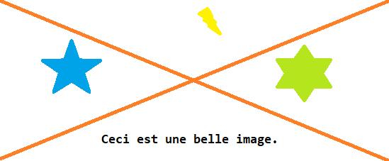

# Titre principal

Du texte d'introduction...

Un autre texte...

## Titre h2

Tu veux du texte ?



Et une petite liste :
- item 1,
- item suivant, allez... sur plusieurs lignes, juste pour voir. J'aime voir. Je n'aime pas entendre. Juste voir. Sans comptendre, comme ça, la chose sous les yeux. J'aime cela. Un petit lien vers [par là](https://duckduckgo.com "contenu bulle"). Ne pas penser, quelles vacances, vraiment ! [prout s](uneImage.png "belle image"). Roo bah dis...,
- dernier item.

Je mettrais bien du **bold** et un peu d'*italique*. ***Un peu des deux, aussi***. Le plus *dur étant **lorsque** tout* est mélangé. ***Autre***. Et puis tiens : **du *méchant* vraiment** lourd.

Et puis, il y a le `code`, tu `sais`.

Tester les cas : ***italique* en gras**, *chose **en gras***.
```
Du code comme ça aussi.
	Avec tabulation, tu `sais`. <bold>des è...
function void toto()
{
	Debug.Log("prout");
	Du MarkDown aussi : [prout](lien "text")
}
```

Bien, voilà.

Une liste imbriquée prise en charge :
- toto
- prout :
   - imbriquée 1
   - **imbriquée** 2

---- Fin de la liste imbriquée -----

Une liste ordonnée :
1. entrée numéro 1
2. Entrée numéro 2
   1. **imbriquée** 1
   2. imbriquée 2

Un mélange de listes :
- ONE
- TWO
- THREE
   1. un  
   2. deux
- FOUR


- 12
   - 12

1. un
   1. un

- deux
   1. deux

1. trois
   - trois